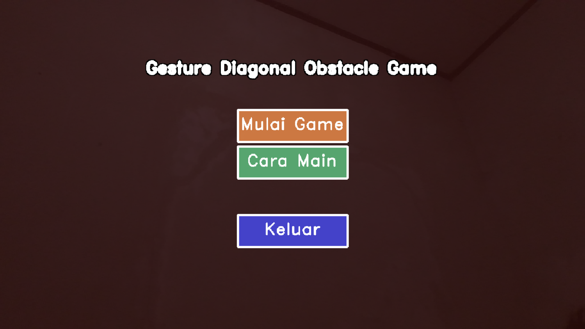
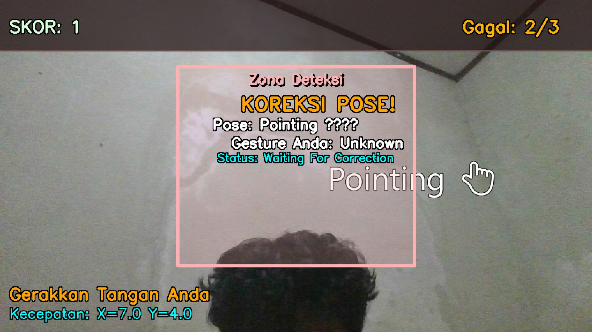
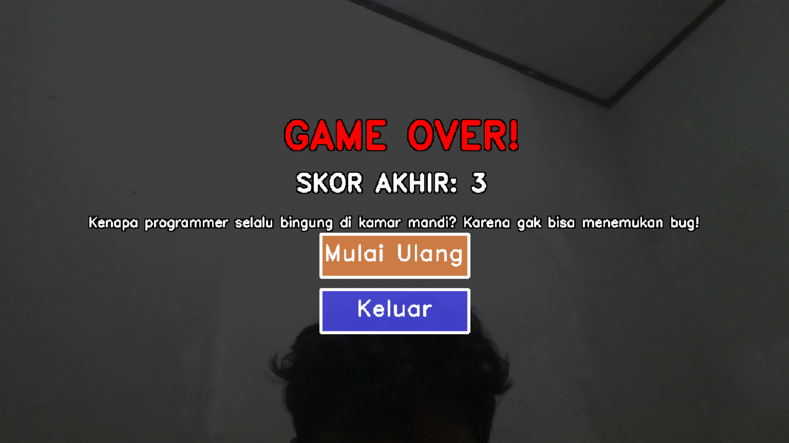

# Hand Motion Control Game 🎮🖐️

[](https://www.python.org/)
[](https://opencv.org/)
[](https://google.github.io/mediapipe/)

---
TIM : Ericson Chandra Sihombing(121450026)
---
Kharisma Gumilang(121450142)
---
Shula Talitha Ardhya Putri (121450087)
---

---

## 📌 Tentang Proyek

**Hand Motion Control Game** adalah sebuah permainan interaktif berbasis pengenalan gesture tangan secara real-time menggunakan webcam.  
Permainan ini menggabungkan teknologi pengolahan citra dari **MediaPipe**, **OpenCV**, dan pemrograman multimedia Python untuk menghadirkan pengalaman bermain yang unik dan edukatif.

Proyek ini dibuat sebagai tugas akhir mata kuliah Sistem / Teknologi Multimedia (IF4021) di Program Studi Teknik Informatika ITERA 2024/2025.

---

## 🎯 Fitur Utama

- 🎥 Deteksi gesture tangan secara real-time menggunakan webcam.
- ✋ Kendali permainan menggunakan pose tangan seperti Open Hand, Peace, Metal, Fist, dan Pointing.
- 🚧 Rintangan bergerak diagonal yang harus dikoreksi dengan gesture yang benar.
- 🎵 Audio feedback untuk berbagai aksi, seperti sukses, peringatan, dan game over.
- 🎮 Gameplay yang menantang dengan sistem retry saat gesture salah.
- 🖼️ Tampilan grafis dengan efek glow pada rintangan dan animasi interaktif.

---

---

## 🛠️ Instalasi dan Persiapan

1. **Clone repository ini:**

    ```bash
    git clone https://github.com/ericsonchandra99/Hand_Motion_Control_Game.git
    cd Hand_Motion_Control_Game
    ```

2. **Buat virtual environment (opsional tapi disarankan):**

    ```bash
    python -m venv venv
    source venv/bin/activate   # Linux/Mac
    venv\Scripts\activate      # Windows
    ```

3. **Install dependencies:**

    ```bash
    pip install -r requirements.txt
    ```

4. **Jalankan game:**

    ```bash
    python main.py
    ```

---

## 📖 Cara Bermain

- Saat permainan berjalan, kamu akan melihat rintangan dengan simbol gesture tertentu bergerak secara diagonal.
- Tempatkan tangan kamu dalam zona deteksi yang ditandai kotak berwarna oranye.
- Tunjukkan pose tangan yang sesuai dengan simbol rintangan saat rintangan masuk zona deteksi.
- Jika pose benar, kamu akan mendapat poin dan rintangan hilang.
- Jika salah, kamu harus mengoreksi pose sebelum rintangan bergerak keluar zona.
- Game berakhir saat gagal melewati rintangan atau gagal koreksi pose.

---

## 🧩 Struktur Kode Utama

- **`main.py`** — Program utama yang menjalankan game dan webcam.
- Fungsi `detect_gesture()` — Mendeteksi pose tangan berdasarkan landmark MediaPipe.
- Fungsi `create_obstacle()` — Membuat rintangan baru dengan gesture acak.
- Fungsi `draw_pose_obstacle()` — Menggambar rintangan dengan efek glow dan emoji.
- Game loop mengelola pergerakan rintangan, pengecekan gesture, skor, dan status game.

---

## ⚙️ Penjelasan Teknologi

| Teknologi    | Deskripsi                                   |
|--------------|---------------------------------------------|
| OpenCV       | Pengolahan video dan gambar secara real-time|
| MediaPipe    | Library deteksi pose dan landmark tangan     |
---

## 📂 Struktur Folder

# Dokumentasi Tampilan Game Pose Tangan

Berikut ini adalah penjelasan dari beberapa tampilan utama dalam game pose tangan:

---

## 1. Tampilan Home Screen (`homescreen.png`)



Tampilan awal permainan yang menjadi muka utama game. Pada layar ini terdapat tombol untuk memulai permainan, serta informasi singkat mengenai kontrol pose tangan yang digunakan. Desainnya dibuat sederhana dan menarik untuk memudahkan pengguna memulai permainan dengan cepat.

---

## 2. Tampilan In-Game (`ingame.png`)



Ini adalah tampilan saat permainan sedang berjalan. Terlihat pose tangan yang harus ditebak oleh pemain sebagai obstacle yang bergerak dari kiri ke kanan. Pada bagian atas kiri layar, terdapat skor yang terus bertambah setiap pemain berhasil mengenali pose dengan benar. Zona deteksi (garis hijau vertikal) menunjukkan area dimana pose tangan akan dicek dan dibandingkan dengan obstacle.

---

## 3. Tampilan Game Over (`gameover.png`)



Tampilan ini muncul saat permainan berakhir karena pemain gagal menyesuaikan pose tangan dengan obstacle pada zona deteksi. Layar menampilkan pesan "GAME OVER" yang mencolok, disertai skor akhir yang diraih pemain. Tampilan ini memberikan feedback langsung kepada pemain sebelum permainan selesai atau di-restart.

---
## 
Gambar "Cara Main" ini ditempatkan di README.md untuk memberikan panduan singkat dan jelas mengenai cara berinteraksi dengan aplikasi. Ini membantu pengguna baru memahami aturan dasar dan alur permainan secara cepat sebelum atau saat mereka mencoba aplikasi, memastikan pengalaman pengguna yang lebih baik dan mengurangi kebingungan.


---


> Penjelasan di atas membantu memberikan gambaran visual dan fungsional dari tiap tahapan permainan pose tangan yang interaktif dan edukatif.

---
Referensi:
- Suara: (https://pixabay.com/)
- Gambar: (https://www.pngegg.com/id/png-yvuzc)
- YouTube: (https://youtu.be/SzebIgHlSSE?si=7xzPNfvHpuZJ9u7E)

---

## 👥 Anggota Kelompok

| Nama Lengkap       | NIM       | GitHub                                      |
|--------------------|-----------|---------------------------------------------|
| Ericson Chandra    | 121450026 | [ericsonchandra99](https://github.com/ericsonchandra99)  |
| Shula Talitha      | 121450087 | [shulatalitha1](https://github.com/shulatalitha1)   |
| Kharisma Gumilang  | 121450142 | [gumilangkharismaa](https://github.com/gumilangkharismaa) |

---

## 📞 Kontak

- Ericson Chandra: [github.com/ericsonchandra99](https://github.com/ericsonchandra99)

- Kharisma Gumilang: [github.com/gumilangkharismaa](https://github.com/gumilangkharismaa)

- Shula Talitha: [github.com/shulatalitha1](https://github.com/shulatalitha1)
---


